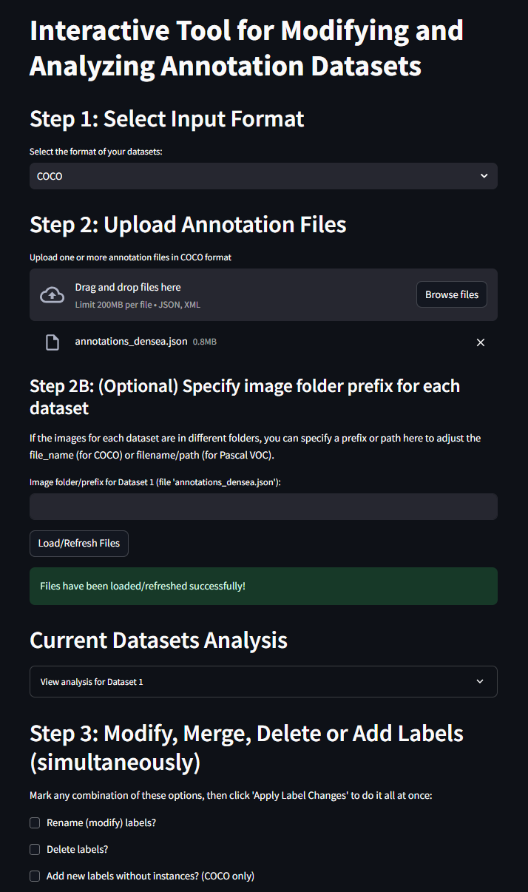

# Interactive Dataset Exportation Tool


## Table of Contents

- [Project Overview](#project-overview)
- [Features](#features)
- [Demo](#demo)
- [Installation](#installation)
  - [Prerequisites](#prerequisites)
  - [Using Docker](#using-docker)
  - [Without Docker](#without-docker)
- [Usage](#usage)
  - [Running the Application](#running-the-application)
  - [Application Workflow](#application-workflow)
- [Contributing](#contributing)
- [License](#license)
- [Contact](#contact)

## Project Overview

The **Interactive Annotation Dataset Tool** is a Streamlit-based web application designed to streamline the management of annotation datasets used in machine learning and computer vision projects. It supports multiple annotation formats, including COCO and Pascal VOC, and provides functionalities to:

- **Load** multiple annotation datasets.
- **Analyze** each dataset individually.
- **Modify**, **merge**, and **delete** labels.
- **Combine** datasets into a single unified dataset.
- **Convert** segmentation annotations to bounding boxes.
- **Add** new empty classes, particularly useful for COCO format.
- **Download** the processed annotations in the desired format.

This tool aims to simplify the preprocessing steps required for preparing datasets, enhancing productivity for data scientists and machine learning engineers.

## Features

- **Multi-Format Support:** Handles COCO, Pascal VOC, and COCO Segmentation formats.
- **Annotation Management:** Modify, rename, delete, and add labels seamlessly.
- **Dataset Merging:** Combine multiple datasets into a single unified dataset.
- **Format Conversion:** Convert between COCO and Pascal VOC annotation formats.
- **Segmentation Handling:** Convert segmentation masks to bounding boxes.
- **User-Friendly Interface:** Intuitive Streamlit-based UI for easy interaction.
- **Docker Support:** Containerize the application for consistent deployments.

## Demo

  

## Installation

You can set up and run the application either using Docker or directly on your local machine. Below are the detailed instructions for both methods.

### Prerequisites

- **Python 3.10 or higher**
- **pip** (Python package manager)
- **Docker** (optional, for containerized setup)

### Using Docker

Docker provides an isolated environment for running your application, ensuring consistency across different systems.

1. **Clone the Repository:**

    ```bash
    git clone https://github.com/asferrer/dataset-exportation-tool.git
    cd dataset-exportation-tool
    ```

2. **Build the Docker Image:**

    ```bash
    docker build -t streamlit-annotation-tool .
    ```

    - **Explanation:**
      - `-t streamlit-annotation-tool`: Tags the image with the name `streamlit-annotation-tool`.
      - `.`: Specifies the build context (current directory).

3. **Run the Docker Container:**

    ```bash
    docker run -d -p 8501:8501 --name annotation_tool streamlit-annotation-tool
    ```

    - **Explanation:**
      - `-d`: Runs the container in detached mode (in the background).
      - `-p 8501:8501`: Maps port `8501` of the host to port `8501` of the container.
      - `--name annotation_tool`: Names the running container `annotation_tool`.
      - `streamlit-annotation-tool`: Specifies the image to run.

4. **Access the Application:**

    Open your web browser and navigate to [http://localhost:8501](http://localhost:8501) to access the Streamlit application.

5. **Stopping and Removing the Container:**

    - **Stop the Container:**

        ```bash
        docker stop annotation_tool
        ```

    - **Remove the Container:**

        ```bash
        docker rm annotation_tool
        ```

    - **Remove the Image (Optional):**

        ```bash
        docker rmi streamlit-annotation-tool
        ```

### Without Docker

If you prefer running the application directly on your local machine without containerization, follow these steps:

1. **Clone the Repository:**

    ```bash
    git clone https://github.com/asferrer/dataset-exportation-tool.git
    cd dataset-exportation-tool
    ```

2. **Set Up a Virtual Environment (Recommended):**

    It's good practice to use a virtual environment to manage dependencies.

    ```bash
    python -m venv venv
    ```

    - **Activate the Virtual Environment:**

        - **On Windows:**

            ```bash
            venv\Scripts\activate
            ```

        - **On macOS and Linux:**

            ```bash
            source venv/bin/activate
            ```

3. **Install Dependencies:**

    ```bash
    pip install --upgrade pip
    pip install -r requirements.txt
    ```

4. **Run the Application:**

    ```bash
    streamlit run app.py
    ```

5. **Access the Application:**

    Open your web browser and navigate to [http://localhost:8501](http://localhost:8501) to access the Streamlit application.

## Usage

### Running the Application

Depending on your installation method (Docker or direct), follow the respective instructions in the [Installation](#installation) section to run the application.

### Application Workflow

1. **Select Input Format:**

    - Choose the format of your annotation datasets: **COCO**, **Pascal VOC**, or **COCO Segmentation**.

2. **Upload Annotation Files:**

    - Upload one or more annotation files in the selected format (`.json` for COCO, `.xml` for Pascal VOC).
    - *(Optional)* Specify image folder prefixes if your datasets' images are stored in different directories.

3. **Load/Refresh Files:**

    - Click the **"Load/Refresh Files"** button to load the uploaded annotation files.
    - The application will process the files, correcting any duplicate IDs (in COCO format) and adjusting file paths based on specified prefixes.

4. **Current Datasets Analysis:**

    - After loading, the application provides an analysis of each dataset, including:
        - Number of images
        - Number of annotations
        - Instances per category
        - Images per category
    - Visualizations are displayed through interactive bar charts.

5. **Modify, Merge, Delete, or Add Labels:**

    - **Rename Labels:** Change the names of existing labels.
    - **Delete Labels:** Remove unwanted labels and their corresponding annotations.
    - **Add New Labels:** Introduce new labels without instances (applicable for COCO format).

    - Define your label modifications through the provided interface and click **"Apply Label Changes"** to execute all changes simultaneously.

6. **Combine Datasets (Optional):**

    - If multiple datasets are loaded, you can choose to merge them into a single dataset.
    - The combined dataset will be analyzed similarly, providing insights into the unified data.

7. **Select Output Format:**

    - Choose the desired format for the output annotations: **COCO** or **Pascal VOC**.

8. **Generate and Download Annotation File(s):**

    - Click the **"Generate and Download Annotation File(s)"** button to produce the processed annotations.
    - Depending on your choices, you can download:
        - A single combined annotation file.
        - Multiple annotation files for each dataset.
        - Converted formats (e.g., Pascal VOC annotations converted to COCO).

## Docker Deployment

For streamlined deployments, especially in production environments, Docker offers an efficient way to containerize your application.

### Building the Docker Image

1. **Navigate to the Project Directory:**

    ```bash
    cd dataset-exportation-tool
    ```

2. **Build the Docker Image:**

    ```bash
    docker build -t streamlit-annotation-tool .
    ```

    - **Explanation:**
      - `-t streamlit-annotation-tool`: Tags the image with the name `streamlit-annotation-tool`.
      - `.`: Specifies the build context (current directory).

### Running the Docker Container

1. **Run the Container:**

    ```bash
    docker run -d -p 8501:8501 --name annotation_tool streamlit-annotation-tool
    ```

    - **Explanation:**
      - `-d`: Runs the container in detached mode (in the background).
      - `-p 8501:8501`: Maps port `8501` of the host to port `8501` of the container.
      - `--name annotation_tool`: Names the running container `annotation_tool`.
      - `streamlit-annotation-tool`: Specifies the image to run.

2. **Access the Application:**

    Open your web browser and navigate to [http://localhost:8501](http://localhost:8501) to access the Streamlit application.

### Managing the Docker Container

- **Stopping the Container:**

    ```bash
    docker stop annotation_tool
    ```

- **Removing the Container:**

    ```bash
    docker rm annotation_tool
    ```

- **Removing the Docker Image (Optional):**

    ```bash
    docker rmi streamlit-annotation-tool
    ```

## Contributing

Contributions are welcome! If you have suggestions, bug reports, or want to contribute new features, please follow the guidelines below:

1. **Fork the Repository:**

    Click the **Fork** button at the top right corner of the repository page to create your own copy.

2. **Clone Your Fork:**

    ```bash
    git clone https://github.com/asferrer/dataset-exportation-tool.git
    cd dataset-exportation-tool
    ```

3. **Create a New Branch:**

    ```bash
    git checkout -b feature/your-feature-name
    ```

4. **Make Your Changes:**

    Implement your feature or fix bugs.

5. **Commit Your Changes:**

    ```bash
    git commit -m "Add feature: your feature description"
    ```

6. **Push to Your Fork:**

    ```bash
    git push origin feature/your-feature-name
    ```

7. **Create a Pull Request:**

    Navigate to the original repository and create a pull request from your fork's branch.

## License

This project is licensed under the [MIT License](LICENSE).

## Contact

For any inquiries or support, please contact:

- **Alejandro Sanchez Ferrer**
- **Email:** [asanc.tech@gmail.com](mailto:asanc.tech@gmail.com)
- **GitHub:** [asferrer](https://github.com/asferrer)

---
